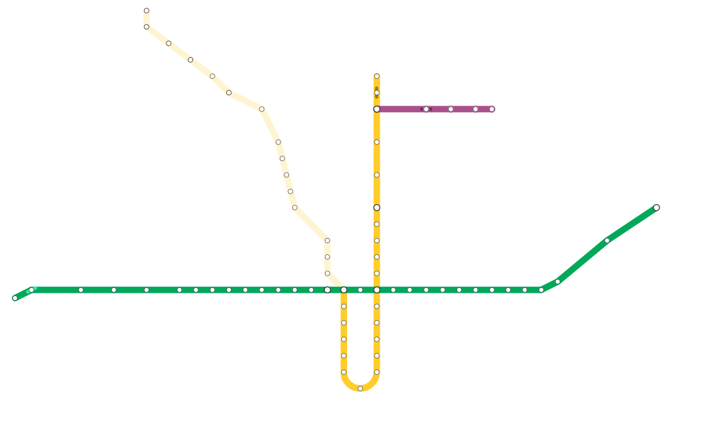

<p align="center">
  
</p>

### Introduction
OpenTransit is a project aimed to create a Live Transit map for the Greater Toronto Area and potentially other parts of the world! Currently, the TTC Subway system map is in development with plans to expand to the TTC streetcar and bus network as well as the GO Train network.

We hope to use APIs in order to get the information of the location of any given vehicle. For the services that do not offer a public API, we are using the information retrieved from the schedule. (Main branch currently is not for development sake).

### Pre-requisites
- Node.js
- Git (If planning on contributing)

### Setup
1) Clone the project or download the zip file and extract the folder.
2) Run ```npm install``` inside both the client and server folder
3) Run ```npm start``` inside the server folder. Have this running in the background. Wait until Train 0, 1, 2 and 3 are sending messages. Otherwise, you might face an error when launching the client.
4) Run ```npm start``` inside the client folder. It should prompt your browser to open to ```localhost:3000```. If not, enter this as your URL in any browser and have fun!

### Current Map
<p align="center">
  
  <p align="center">Line 1, 2 and 4 of TTC Subway System. Light colored sections aren't currently animated.</p>
</p>


### Contributing
You can find yourself contributing in any number of ways. 
- For those who are developers, feel free to look through the client or server source code to see if you see any room for improvement!
- If you are a designer or map developer, you might find yourself intrigued by the client/src/components folder. In the Lines folder within the Maps folder, you will see that each line.js returns fragments of an SVG file regarding that line.
- If you are interested in the animation of the trains, going into server/data and js file for each of the lines will display a list of animations that correspond to the animation the train plays when going to the next station.

